# 🛡️ Threat Hunt Case File — Meridian Healthcare Portal Intrusion

> A single-host web-app intrusion, hunted end-to-end in **Microsoft Sentinel / Log Analytics (KQL)** — from recon to a still-live backdoor. The twist: an active automated defence stack was generating its own telemetry the whole time, so half the skill is telling **real intrusion** apart from **automated remediation noise**.

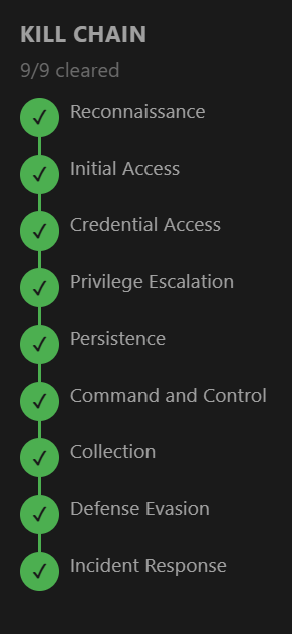

**Analyst:** SR (Sobia)  ·  **Workspace:** `LAW-HuntPractice`  ·  **Platform:** Microsoft Sentinel / KQL
**Incident:** 2026-02-06, 02:42–05:30 UTC  ·  **Result:** ✅ Kill chain 9 / 9 cleared

---

## 📑 Contents

- [1. The Case to Solve](#1-the-case-to-solve)
- [2. Kill Chain Clarification](#2-kill-chain-clarification)
- [3. Timeline of All Events](#3-timeline-of-all-events)
- [4. How I Solved It (step by step)](#4-how-i-solved-it-step-by-step)
- [5. All KQL Queries Used](#5-all-kql-queries-used)
- [6. MITRE ATT&CK Mapping](#6-mitre-attck-mapping)
- [7. Key Takeaways](#7-key-takeaways)

---

## 1. The Case to Solve

Overnight, the **Meridian healthcare portal** threw a real incident. The whole intrusion happened on **one server**, with a six-service **automated defence stack** running the entire time — fighting back on its own and writing its own logs.

**Environment**

- **Target host:** `ip-10-1-15-67` (10.1.15.67), Ubuntu 22.04
- **Role:** Web app server — **Apache + PHP + MySQL** running a patient portal in front of a **patient database**
- **Attacker:** external IP **`10.1.134.57`**
- **Window:** 2026-02-06, ~**02:42 → 05:30 UTC** (~3 hours)
- **The twist:** the defence suite kept **reverting SSH keys, crontabs, and temp dirs** and logging detections — so the logs mix *attacker actions* with *automated clean-up*

**Log tables (data sources)**

| Table | What it holds |
|---|---|
| `MeridianAccess_CL` | Web access log (HTTP requests, URIs, status codes, user-agents) |
| `MeridianAuth_CL` | Auth log (sshd, sudo, su — logins & failures) |
| `MeridianAudit_CL` | Linux auditd — every command run, with real/effective UID |
| `MeridianDefender_CL` | Defence stack detections & remediation (SWEEP, DETECTION, NETWORK…) |
| `MeridianSnapshot_CL` | Process snapshots (suspicious procs, UID sets, parent PIDs) |
| `MeridianNetwork_CL` | Network connections (netstat/ss states, local/remote addresses) |
| `MeridianMySQL_CL` | MySQL query log |
| `MeridianSyslog_CL` | General system log |

**The four golden rules of this hunt**

1. **Always order/filter by `EventTime_t`, never `TimeGenerated`.** `TimeGenerated` is *ingestion* time, not event time.
2. **Always add `| where isnotempty(EventTime_t)`** to drop junk rows from a failed earlier ingestion.
3. **A detection-log line is not proof by itself** — correlate it with a confirmed attacker source.
4. **Don't fill evidence gaps with assumptions** — report gaps as gaps.

---

## 2. Kill Chain Clarification

The kill chain is the story of an attack told in order. Here's each stage in plain English + what it was here.

| # | Stage | What it means | What it was here |
|---|---|---|---|
| 1 | Reconnaissance | Map the target before touching anything | nmap, curl, whatweb, gobuster scans |
| 2 | Initial Access | Find a way in | LFI bug in `config_viewer.php` |
| 3 | Credential Access | Steal login credentials | Read `database.conf`, SSH in as `svc_backup` |
| 4 | Privilege Escalation | Try to become root | SUID shell `/tmp/rootbash -p` (sudo/root-SSH failed) |
| 5 | Persistence | Plant a way to keep access | Disguised backdoor `/opt/meridian/scripts/health_check` |
| 6 | Command & Control | Backdoor phones home | Beacon to `10.1.134.57:43212` |
| 7 | Collection | Gather the target data | Full **patient database** export |
| 8 | Defense Evasion | Hide from / blind defenders | Separated bootstrap noise; friendly-fire loss of sysmon |
| 9 | Incident Response | React & contain | Memory captured with avml — backdoor still live |

---

## 3. Timeline of All Events

All times **UTC, 2026-02-06**. Attacker IP `10.1.134.57`, host `ip-10-1-15-67`. Rows marked *(defence / baseline)* are **not** the attacker — separating them is the whole point.

| Time (UTC) | Stage | Event |
|---|---|---|
| 02:53:31 | *Defence noise* | DETECTION burst: SSH key + crontab + new systemd service, auto-reverted (stack booting itself) |
| 02:56:33 | *Baseline* | SSH login `svc_backup` from 127.0.0.1 (localhost backup job) |
| 02:58:26 | *Baseline* | DB: full patient table query (scheduled backup) |
| 03:08:17–22 | *Defence / collateral* | First IR Sweep: reverts keys/crontabs/temp dirs, **removes `sysmon.service`** (friendly fire) |
| **03:47:32** | Recon | **nmap** scan begins from 10.1.134.57 — first real attacker activity |
| 03:52:09 | Recon | **curl** hand-typed probing (`/`, `/robots.txt`) |
| 03:52:29 | Recon → Access | curl `GET /config_viewer.php` → **302** (found the LFI page) |
| 03:54:54 | Recon | **whatweb** fingerprints the stack |
| 03:55:05 | Recon | **gobuster** mass scan (18,454 requests) |
| 03:56:28 | Collection | DEFENDER flags *"Patient data export from 10.1.134.57"* |
| 04:07:59 | Initial Access | LFI reads `/etc/passwd` via `?file=../../../etc/passwd` (200) |
| 04:08:34 | Initial Access | LFI reads `database.conf` (200) — steals service creds |
| ~04:09 | Credential Access | SSH login as `svc_backup` (stolen creds) |
| 04:15:07 | Priv Esc (fail) | `sudo` by svc_backup → *"command not allowed"* |
| **04:40:15** | Priv Esc (success) | `/tmp/rootbash -p` executed, **euid=0** — ROOT via SUID shell |
| 04:44–04:47 | Priv Esc (fail) | Failed root SSH logins from 10.1.134.57 |
| 04:48:28 | Command & Control | DEFENDER *"Blocked exfil to 10.1.134.57:43212"* (×73) |
| ~04:51 | Persistence | `health_check` backdoor planted in `/opt/meridian/scripts/` (PID 267155, euid 0, PPID 1) |
| 05:05:01 | Defence | SWEEP kills PID from /tmp (`/tmp/rootbash -p`) |
| 05:05:02 | Defence | SWEEP: `backup.conf` tampered — reverting |
| 05:05:06 | Defence | SWEEP removes SUID `/tmp/rootbash`; flags `health_check` *non-baseline* (**logged only, not removed**) |
| 05:23:01 | Incident Response | Admin `ubuntu` returns: `sudo -i` → `/bin/bash` |
| 05:27:48 | Incident Response | avml memory capture #1 → `/tmp/evidence/memory.lime` |
| 05:28:24 | Incident Response | avml memory capture #2 → `/tmp/evidence/memory.lime` |
| ⚠️ **STILL OPEN** | Not contained | `health_check` (PID 267155) still running — IR must manually kill + delete it |

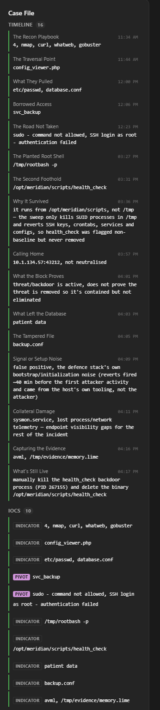

---

## 4. How I Solved It (step by step)

### First: getting into the data (the setup gotcha)

- Tables wouldn't resolve — I was in the **wrong workspace** (`LAW-Cyber-Range`). Fix: switch to **`LAW-HuntPractice`** → **Logs** blade.
- Then results were empty. Cause: the time picker filters on **`TimeGenerated`** (ingestion time), but events are stamped months earlier in **`EventTime_t`**. Fix: set time range to **"Set in query"** and let `EventTime_t` filter.
- **Lesson: `TimeGenerated` ≠ `EventTime_t`.** This one distinction unblocked the entire hunt.

---

### Stage 1 — Reconnaissance: The Recon Playbook

**Q:** How many distinct recon tools hit the web server, in order they first appeared?

- Every tool stamps its own `UserAgent_s`. Grouped attacker requests by user-agent, took earliest time each appeared.
- Four tools, first-seen order: **nmap** (03:47) → **curl** (03:52) → **whatweb** (03:54) → **gobuster** (03:55, 18,454 requests).

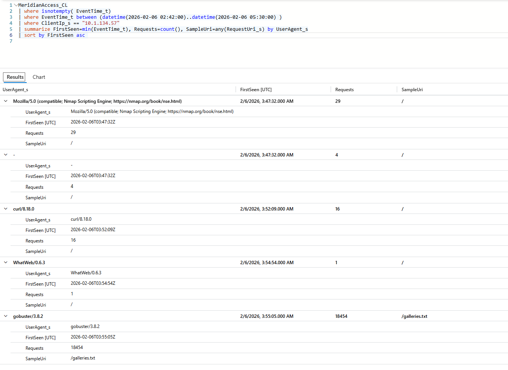

✅ **Answer:** `4, nmap, curl, whatweb, gobuster`

---

### Stage 2 — Initial Access: The Traversal Point & What They Pulled

**Q:** The endpoint touched before the mass scan (the way in), and the two files the LFI pulled.

- Filtered out gobuster noise, looked at hand-typed (curl) requests before 03:55:05, then read successful (200) reads through the page's `?file=` param.
- Pre-scan touch: **`config_viewer.php`** (curl, 03:52:29, 302). It has an **LFI** bug — `../../../` traversal lets it read any file. It read **`/etc/passwd`** then **`database.conf`**.

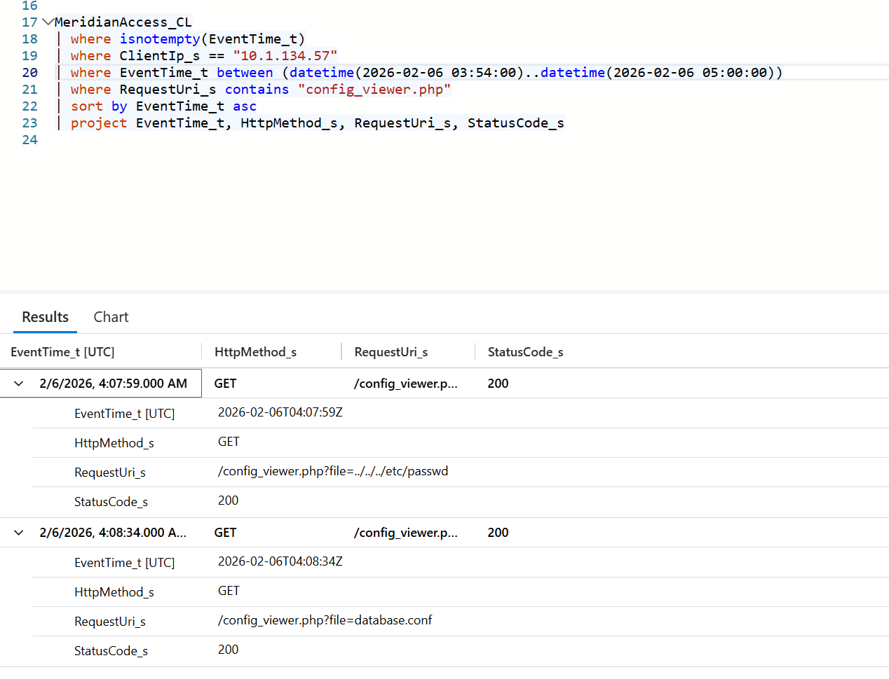

✅ **Answer:** `config_viewer.php` · `etc/passwd, database.conf`

---

### Stage 3 — Credential Access: Borrowed Access & The Road Not Taken

**Q:** Which real account did they SSH in as? Besides the SUID shell, what two other root attempts failed and why?

- `database.conf` carries reusable creds → checked who logged in over SSH right after. Checked `sudo`/`su` + failed root logins for the failed attempts.
- SSH'd in as **`svc_backup`** (real account, not created).
- Fail #1: **sudo** → `command not allowed`. Fail #2: **SSH as root** → repeated `Failed login 'root'` (no root password).

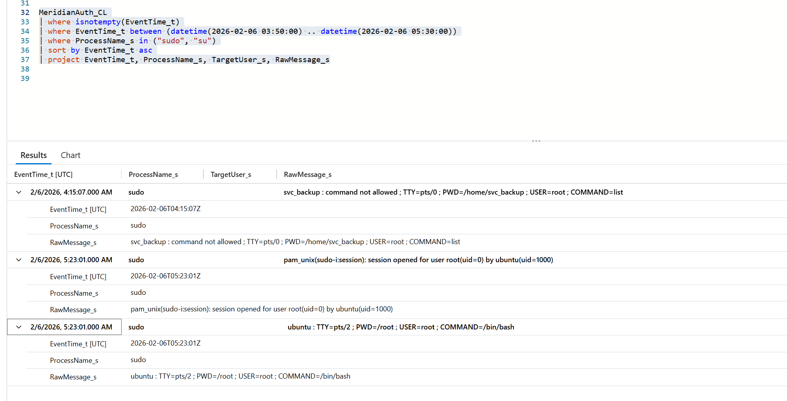

✅ **Answer:** `svc_backup` · `sudo - command not allowed, SSH login as root - authentication failed`

---

### Stage 4 — Privilege Escalation: The Planted Root Shell

**Q:** They got root through a binary already on disk. Full path + flag?

- sudo said no → the fallback is a SUID-root shell. Searched the audit log for the execution.
- **04:40:15**: `/tmp/rootbash -p` ran with **`euid=0`** (root) while `auid=1001` (svc_backup). The **`-p`** flag keeps root privileges instead of dropping them.

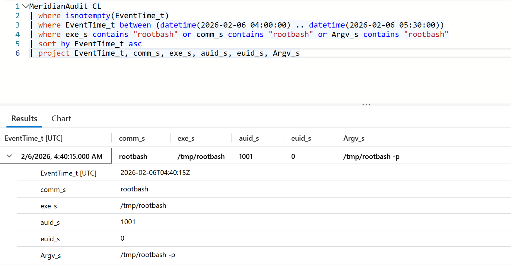

✅ **Answer:** `/tmp/rootbash -p`

---

### Stage 5 — Persistence: The Second Foothold & Why It Survived

**Q:** The better-hidden SUID shell's full path, and why the sweep couldn't remove it.

- Checked the process snapshot for a proc with real≠effective UID living somewhere legit-looking; cross-referenced what the sweep *fixed* vs only *logged*.
- Backdoor: **`/opt/meridian/scripts/health_check`** (PID 267155, UID set `1001 0 0 0`, PPID 1 = orphaned daemon).
- Survived because the sweep only auto-cleans **SSH keys, crontabs, temp dirs, services, configs**, and only kills SUID procs **from `/tmp`**. A SUID binary in `/opt` is outside every rule → flagged *non-baseline* but never removed.

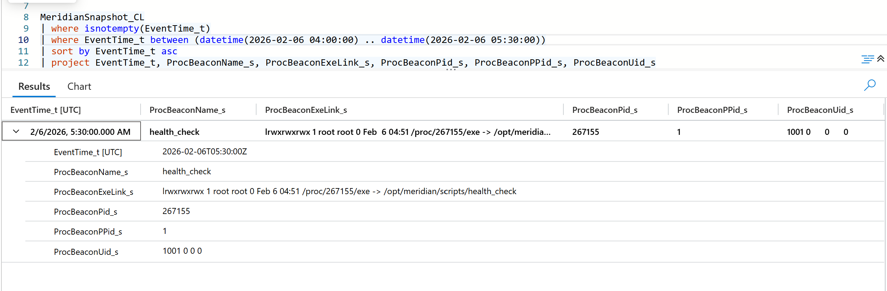
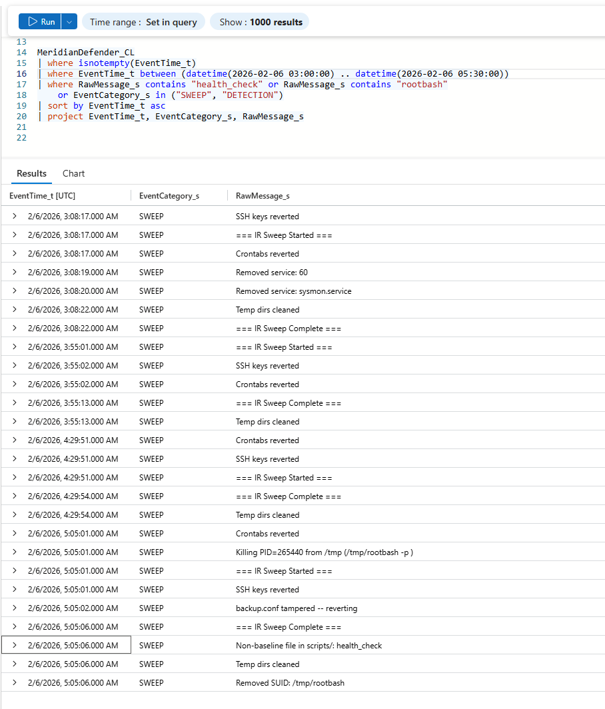

✅ **Answer:** `/opt/meridian/scripts/health_check` · *outside the sweep's cleanup categories → only logged, not removed*

---

### Stage 6 — Command and Control: Calling Home

**Q:** The C2 destination it kept hitting, and whether blocking it neutralised it.

- The network snapshot only showed LISTEN sockets, so I read the defence log's NETWORK detections.
- Beacon to **`10.1.134.57:43212`** (attacker's own IP), firewall logged *"Blocked exfil"* **73 times**.
- **Not neutralised** — a firewall block stops the *connection*, but `health_check` was never killed (still running at 05:30). Block ≠ kill.

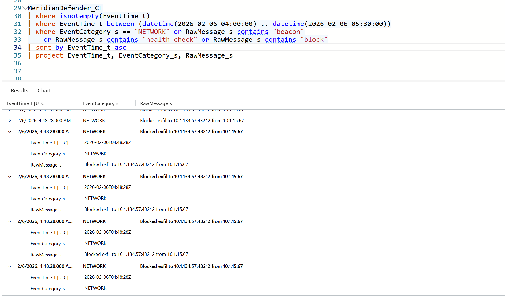

✅ **Answer:** `10.1.134.57:43212, not neutralised`

---

### Stage 7 — Collection: What Left the Database

**Q:** What kind of data was exported? And the tampered config the sweep reverted?

- Healthcare portal → the dataset that matters is patient data. Confirmed via the DB/export detection; read the full last sweep cycle for the config revert.
- Defence flagged **"Patient data export from 10.1.134.57"** → **patient data (PHI)**. The sweep also reverted a tampered **`backup.conf`**.

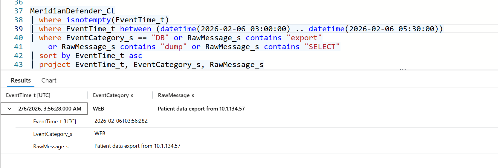

✅ **Answer:** `patient data` · `backup.conf`

---

### Stage 8 — Defense Evasion: Signal or Setup Noise & Collateral Damage

**Q:** Was the early detection burst the intrusion? And the "new systemd service" the first sweep removed — name it + the cost.

- Compared the burst timestamps to the first confirmed attacker activity (nmap, 03:47:32); checked what the first sweep removed.
- Burst fired **02:53:31 — ~54 min before** any attacker activity, from the host itself → **false positive** (defence stack bootstrap noise).
- The first sweep removed **`sysmon.service`** (03:08:20) — a **defensive** tool → **process/network telemetry gaps** for the rest of the incident (friendly fire).

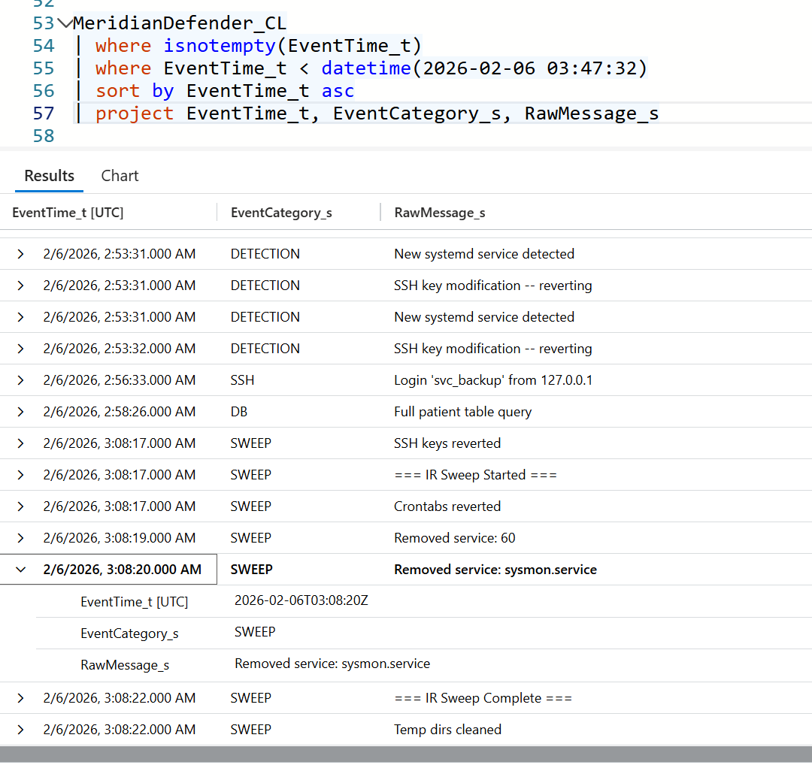

✅ **Answer:** `false positive (defence bootstrap noise)` · `sysmon.service, endpoint visibility gaps`

---

### Stage 9 — Incident Response: Capturing the Evidence & What's Still Live

**Q:** What tool captured volatile state (and where), and the one manual action left to contain this?

- Looked for a forensic acquisition command run by the returning admin as root; walked back through fixed-vs-logged to find the active artefact.
- Admin captured memory **twice** with **avml** → **`/tmp/evidence/memory.lime`** (05:27:48 & 05:28:24) — preserving the live backdoor before disturbing it.
- Still live: **`health_check` (PID 267155)** was never killed → IR must **kill the process and delete the binary**.

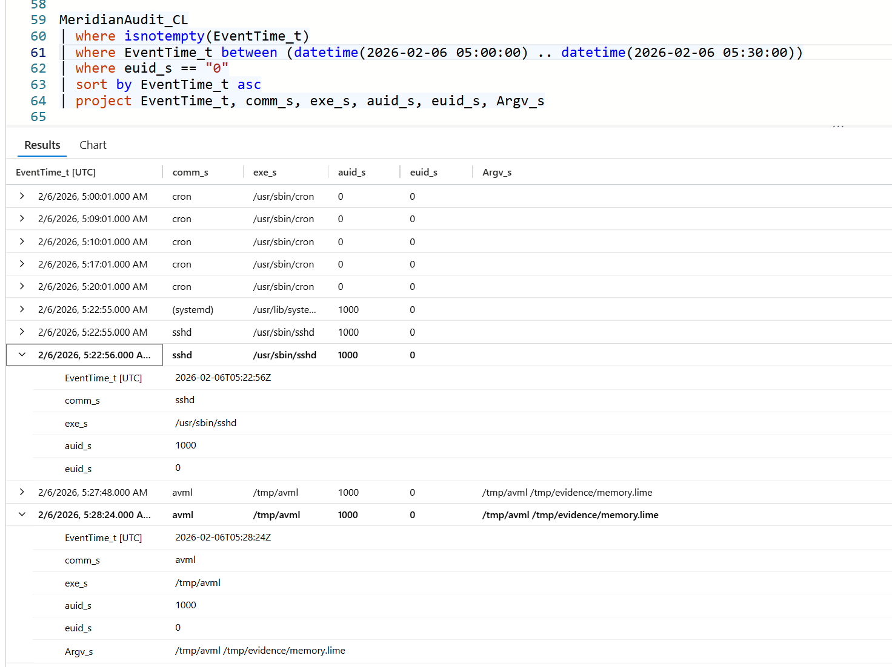

✅ **Answer:** `avml, /tmp/evidence/memory.lime` · *manually kill health_check (PID 267155) & delete `/opt/meridian/scripts/health_check`*

---

## 5. All KQL Queries Used

> Every query uses the two golden filters (`isnotempty(EventTime_t)` + time-scope on `EventTime_t`). Run with time range = **"Set in query"**.

**5.1 Recon — distinct tools by user-agent**
```kql
MeridianAccess_CL
| where isnotempty(EventTime_t)
| where ClientIp_s == "10.1.134.57"
| summarize FirstSeen=min(EventTime_t), Requests=count(), SampleUri=any(RequestUri_s) by UserAgent_s
| sort by FirstSeen asc
```

**5.2 Initial Access — hand-typed requests before the scan**
```kql
MeridianAccess_CL
| where isnotempty(EventTime_t)
| where ClientIp_s == "10.1.134.57"
| where UserAgent_s != "gobuster/3.8.2"
| where EventTime_t < datetime(2026-02-06 03:55:05)
| sort by EventTime_t asc
| project EventTime_t, HttpMethod_s, RequestUri_s, StatusCode_s, UserAgent_s
```

**5.3 What the LFI pulled**
```kql
MeridianAccess_CL
| where isnotempty(EventTime_t)
| where ClientIp_s == "10.1.134.57"
| where RequestUri_s contains "config_viewer.php"
| sort by EventTime_t asc
| project EventTime_t, HttpMethod_s, RequestUri_s, StatusCode_s
```

**5.4 Credential Access — SSH login after database.conf read**
```kql
MeridianAuth_CL
| where isnotempty(EventTime_t)
| where SourceIP == "10.1.134.57"
| where EventTime_t between (datetime(2026-02-06 04:08:00) .. datetime(2026-02-06 04:15:00))
| sort by EventTime_t asc
| project EventTime_t, ProcessName_s, TargetUser_s, SourcePort_s, RawMessage_s
```

**5.5 sudo & su attempts**
```kql
MeridianAuth_CL
| where isnotempty(EventTime_t)
| where EventTime_t between (datetime(2026-02-06 03:00:00) .. datetime(2026-02-06 05:30:00))
| where ProcessName_s in ("sudo", "su")
| sort by EventTime_t asc
| project EventTime_t, ProcessName_s, TargetUser_s, RawMessage_s
```

**5.6 Failed root SSH logins (defence log)**
```kql
MeridianDefender_CL
| where isnotempty(EventTime_t)
| where EventTime_t between (datetime(2026-02-06 04:00:00) .. datetime(2026-02-06 05:30:00))
| where RawMessage_s contains "Failed"
| sort by EventTime_t asc
| project EventTime_t, EventCategory_s, RawMessage_s
```

**5.7 The planted root shell (audit log)**
```kql
MeridianAudit_CL
| where isnotempty(EventTime_t)
| where exe_s contains "rootbash" or comm_s contains "rootbash" or Argv_s contains "rootbash"
| sort by EventTime_t asc
| project EventTime_t, comm_s, exe_s, auid_s, euid_s, Argv_s
```

**5.8 Persistence — disguised backdoor (process snapshot)**
```kql
MeridianSnapshot_CL
| where isnotempty(EventTime_t)
| sort by EventTime_t asc
| project EventTime_t, ProcBeaconName_s, ProcBeaconExeLink_s, ProcBeaconPid_s, ProcBeaconPPid_s, ProcBeaconUid_s
```

**5.9 Why it survived (fixed vs logged)**
```kql
MeridianDefender_CL
| where isnotempty(EventTime_t)
| where RawMessage_s contains "health_check" or RawMessage_s contains "rootbash"
    or EventCategory_s in ("SWEEP", "DETECTION")
| sort by EventTime_t asc
| project EventTime_t, EventCategory_s, RawMessage_s
```

**5.10 C2 — outbound connections (drop LISTEN noise)**
```kql
MeridianNetwork_CL
| where isnotempty(EventTime_t)
| where EventTime_t between (datetime(2026-02-06 04:40:00) .. datetime(2026-02-06 05:30:00))
| where State_s != "LISTEN"
| sort by EventTime_t asc
| project EventTime_t, State_s, LocalAddress_s, PeerAddress_s, RawLine_s
```

**5.11 C2 — beacon destination & firewall block**
```kql
MeridianDefender_CL
| where isnotempty(EventTime_t)
| where EventCategory_s == "NETWORK" or RawMessage_s contains "beacon"
    or RawMessage_s contains "health_check" or RawMessage_s contains "block"
| sort by EventTime_t asc
| project EventTime_t, EventCategory_s, RawMessage_s
```

**5.12 Collection — patient data export**
```kql
MeridianDefender_CL
| where isnotempty(EventTime_t)
| where EventCategory_s == "DB" or RawMessage_s contains "export"
    or RawMessage_s contains "dump" or RawMessage_s contains "SELECT"
| sort by EventTime_t asc
| project EventTime_t, EventCategory_s, RawMessage_s
```

**5.13 The tampered config file**
```kql
MeridianDefender_CL
| where isnotempty(EventTime_t)
| where EventCategory_s == "SWEEP"
| where RawMessage_s contains "tamper" or RawMessage_s contains ".conf" or RawMessage_s contains "reverting"
| sort by EventTime_t asc
| project EventTime_t, EventCategory_s, RawMessage_s
```

**5.14 Defense Evasion — everything before the first attacker activity**
```kql
MeridianDefender_CL
| where isnotempty(EventTime_t)
| where EventTime_t < datetime(2026-02-06 03:47:32)
| sort by EventTime_t asc
| project EventTime_t, EventCategory_s, RawMessage_s
```

**5.15 Incident Response — forensic acquisition (avml)**
```kql
MeridianAudit_CL
| where isnotempty(EventTime_t)
| where EventTime_t between (datetime(2026-02-06 05:00:00) .. datetime(2026-02-06 05:30:00))
| where euid_s == "0"
| sort by EventTime_t asc
| project EventTime_t, comm_s, exe_s, auid_s, euid_s, Argv_s
```

**5.16 Bonus — master timeline (union across all tables)**
```kql
union
    ( MeridianAccess_CL | where ClientIp_s == "10.1.134.57" and UserAgent_s != "gobuster/3.8.2"
        | extend Source="WEB", Detail=strcat(HttpMethod_s, " ", RequestUri_s, " -> ", StatusCode_s, " [", UserAgent_s, "]") ),
    ( MeridianAuth_CL | extend Source="AUTH", Detail=strcat(ProcessName_s, ": ", RawMessage_s) ),
    ( MeridianAudit_CL | where Argv_s contains "rootbash" or euid_s == "0"
        | extend Source="AUDIT", Detail=strcat(comm_s, " | ", Argv_s, " (euid=", euid_s, ")") ),
    ( MeridianDefender_CL | extend Source="DEFENDER", Detail=strcat(EventCategory_s, ": ", RawMessage_s) )
| where isnotempty(EventTime_t)
| where EventTime_t between (datetime(2026-02-06 02:42:00) .. datetime(2026-02-06 05:30:00))
| sort by EventTime_t asc
| project EventTime_t, Source, Detail
```

---

## 6. MITRE ATT&CK Mapping

| Technique | Where it appeared |
|---|---|
| T1595 — Active Scanning | Recon: nmap / whatweb / gobuster |
| T1190 — Exploit Public-Facing Application | Initial Access: LFI in config_viewer.php |
| T1005 — Data from Local System | LFI reads of /etc/passwd and database.conf |
| T1552.001 — Credentials In Files | Creds from database.conf |
| T1078 — Valid Accounts | SSH login as svc_backup |
| T1548.001 — Setuid and Setgid | SUID shells: /tmp/rootbash and health_check |
| T1036 / T1036.005 — Masquerading / Match Legitimate Name | health_check disguised in /opt/meridian/scripts |
| T1564.001 — Hidden Files and Directories | Backdoor staging / blend-in locations |
| T1071 — Application Layer Protocol | C2 beacon to 10.1.134.57:43212 |
| T1213 — Data from Information Repositories | Patient database targeted |
| T1565.001 — Stored Data Manipulation | backup.conf tampering |
| T1562.001 — Impair Defenses: Disable/Modify Tools | sysmon.service removed (here: friendly fire) |

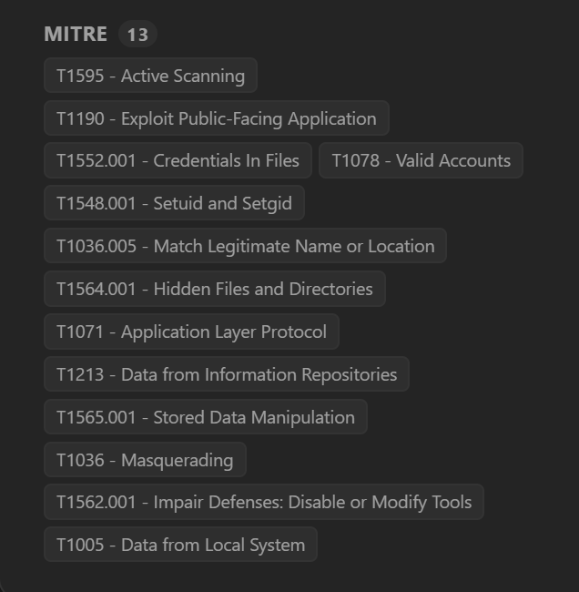

---

## 7. Key Takeaways

- **`TimeGenerated` is a trap.** It's ingestion time — hunt on `EventTime_t` or you'll see zero rows for a real incident.
- **Detection ≠ remediation.** The defence stack *saw* the `health_check` backdoor every sweep and still couldn't remove it (no cleanup rule for `/opt`). A blocked connection and a killed process are different things.
- **Automated defence makes its own noise.** The scary 02:53 detection burst was the tool booting itself, ~54 min before the attacker. Correlate with a confirmed source before trusting a detection.
- **Automated cleanup causes friendly fire.** A "revert to baseline" sweep removed `sysmon.service`, blinding the investigation and creating the very evidence gaps in this case.
- **Contained ≠ closed.** The backdoor is still alive. Final manual step: kill **PID 267155** and delete **`/opt/meridian/scripts/health_check`**.

---

<sub>Educational threat-hunt exercise. All IPs, hostnames, and data are lab/synthetic. Built in Microsoft Sentinel / Log Analytics using KQL.</sub>
